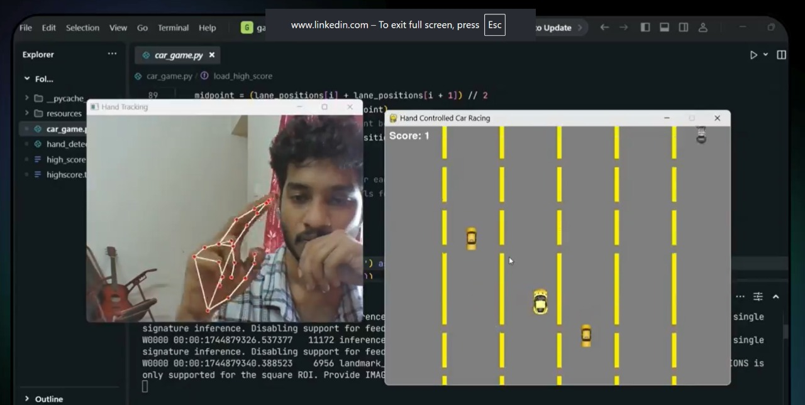

# 🚗 Hand Controlled Car Game

Control your car *without touching a keyboard*! This game uses **real-time hand tracking** to detect your finger movement and steer the car accordingly.

 <!-- Replace with actual image or GIF if available -->

---

## 🎮 Features

- 🖐️ Real-time finger movement detection using webcam
- 🚧 Dynamic obstacles that get harder over time
- 🛡️ Collectible shields and power-ups
- 🏁 Score system with increasing difficulty
- ⚡ Smooth, responsive visuals powered by **Pygame**

---

## 📦 Tech Stack

- **Python**
- **OpenCV** – for webcam input and image processing
- **MediaPipe** – for hand and finger tracking
- **Pygame** – for graphics and game mechanics

---

## 🚀 Getting Started

### Prerequisites
- Python 3.7 or higher

### Installation

```bash
git clone https://github.com/yourusername/finger-car-game.git
cd finger-car-game
pip install -r requirements.txt
```

Run the Game
python main.py

Make sure your webcam is enabled and properly positioned!

🖼️ Controls
Move your index finger left or right to steer the car.

Avoid obstacles and collect power-ups to boost your score.


🧠 Inspiration
Built to explore the intersection of computer vision and interactive games, this project shows how AI tools like MediaPipe can create fun, touchless experiences.

🤝 Contributing
Got ideas or improvements? Feel free to open issues or submit a pull request!

📜 License
This project is licensed under the MIT License – see the LICENSE file for details.

Made with 💜 by Mevin Manuel
